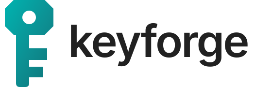

### ₹500 का बोर्ड, एक ब्राउज़र टैब, और आपकी अपनी FIDO2 सिक्योरिटी की।

[English](README.md) · [keyzforge.xyz](https://keyzforge.xyz) · [योगदान करें](CONTRIBUTING.md)

---

## Keyzforge क्या है?

Keyzforge एक ओपन-सोर्स प्रोजेक्ट है जो सस्ते ESP32 या Raspberry Pi Pico बोर्ड को **FIDO2 / पासकी सिक्योरिटी की** में बदल देता है।
सब कुछ ब्राउज़र में होता है: कोई सॉफ़्टवेयर इंस्टॉल नहीं, कोई ड्राइवर नहीं, कोई अकाउंट नहीं।

भारत में ब्रांडेड सिक्योरिटी की ₹2,500 से ₹7,000 तक की आती है। वही सुरक्षा (फ़िशिंग से बचाने वाली पासकी, PIN, OATH और OTP)
₹300 से ₹700 के बोर्ड पर चल सकती है। Keyzforge का मकसद है कि हर छात्र, कॉलेज, छोटी टीम और आम इंसान अपनी की खुद बना सके,
देख सके कि उस पर क्या चल रहा है, और उसे बदल सके।

## यह क्या करता है

| | |
| --- | --- |
| ⚡ **फ़्लैश** | ESP32-S3 / S2 को Web Serial से और RP2040 / RP2350 को WebUSB से फ़र्मवेयर लिखें। लिखने से पहले फ़ाइल की जाँच होती है। |
| 🎛️ **कॉन्फ़िगर** | LED पिन, रंग, ब्राइटनेस, USB नाम और सिक्योर बूट। हर बदलाव बोर्ड का BOOT बटन दबाकर पक्का होता है। |
| 🔑 **पासकी** | PIN सेट करें, देखें किन साइटों की पासकी की पर हैं, और पुरानी हटाएँ। आपका PIN इसी टैब में एन्क्रिप्ट होता है। |
| 🖥️ **मॉनिटर** | बोर्ड का बूट लॉग पढ़ें और आसान भाषा में सलाह पाएँ। |
| 🧬 **ओपन फ़र्मवेयर** | फ़र्मवेयर [`firmware/`](firmware) में है और GitHub Actions पर सबके सामने बनता है। फ़ोर्क करें और अपना बनाएँ। |

## समर्थित बोर्ड

| चिप | उदाहरण |
| --- | --- |
| ESP32-S3 | Waveshare ESP32-S3-Zero, DevKitC-1 |
| ESP32-S2 | Lolin S2 Mini |
| RP2350 | Raspberry Pi Pico 2 |
| RP2040 | Raspberry Pi Pico, RP2040-Zero |

डेस्कटॉप पर Chrome या Edge चाहिए। Firefox और Safari में WebUSB नहीं है।

## शुरू कैसे करें

1. [keyzforge.xyz/flash](https://keyzforge.xyz/flash) खोलें।
2. बोर्ड का **BOOT** बटन दबाकर उसे USB में लगाएँ।
3. अपनी चिप चुनें, **Keyzforge firmware** चुनें, और **Flash firmware** दबाएँ।
4. **Configure** में LED सेट करें, फिर **Passkeys** में PIN सेट करें।
5. अपने अकाउंट (Google, GitHub, Microsoft आदि) में इसे पासकी या सिक्योरिटी की की तरह जोड़ें।

> ज़रूरी: किसी भी सिक्योरिटी की की तरह, अपने अकाउंट में लॉग इन करने का दूसरा तरीका (बैकअप की या रिकवरी कोड) ज़रूर रखें।

## योगदान करें

यह कम्युनिटी का प्रोजेक्ट है। आप मदद कर सकते हैं:

- **बोर्ड जोड़कर:** जो बोर्ड आपके पास चलता है, उसकी LED सेटिंग **Board support** इश्यू में बताएँ।
- **अनुवाद करके:** तमिल, तेलुगु, बंगाली, मराठी, कन्नड़, गुजराती या किसी भी भाषा में README (`README.<code>.md`)।
- **कोड से:** वेब ऐप `src/` में (TypeScript) और फ़र्मवेयर `firmware/` में (C) है।
  [CONTRIBUTING.md](CONTRIBUTING.md) और [firmware/ARCHITECTURE.md](firmware/ARCHITECTURE.md) से शुरू करें।

## लाइसेंस

Keyzforge फ़्री सॉफ़्टवेयर है, [GNU AGPL-3.0](LICENSE) के तहत। फ़र्मवेयर ओपन-सोर्स pico-fido कोड बेस (AGPL-3.0, Pol Henarejos)
पर आधारित है। पूरी जानकारी [THIRD_PARTY_NOTICES.md](THIRD_PARTY_NOTICES.md) में है।

Keyzforge एक स्वतंत्र प्रोजेक्ट है। Espressif, Raspberry Pi या FIDO Alliance से इसका कोई संबंध नहीं है।
