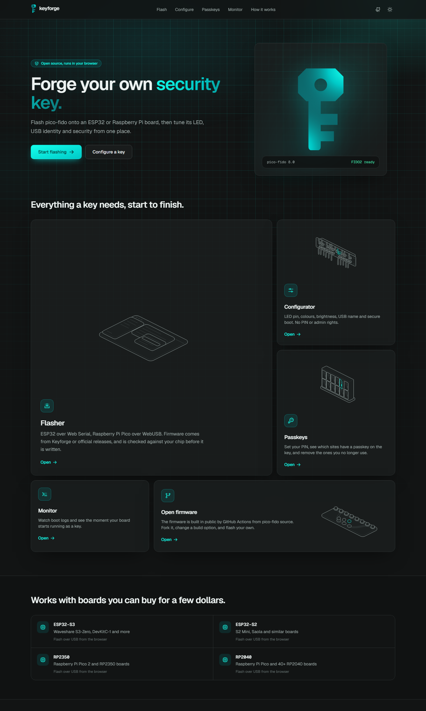
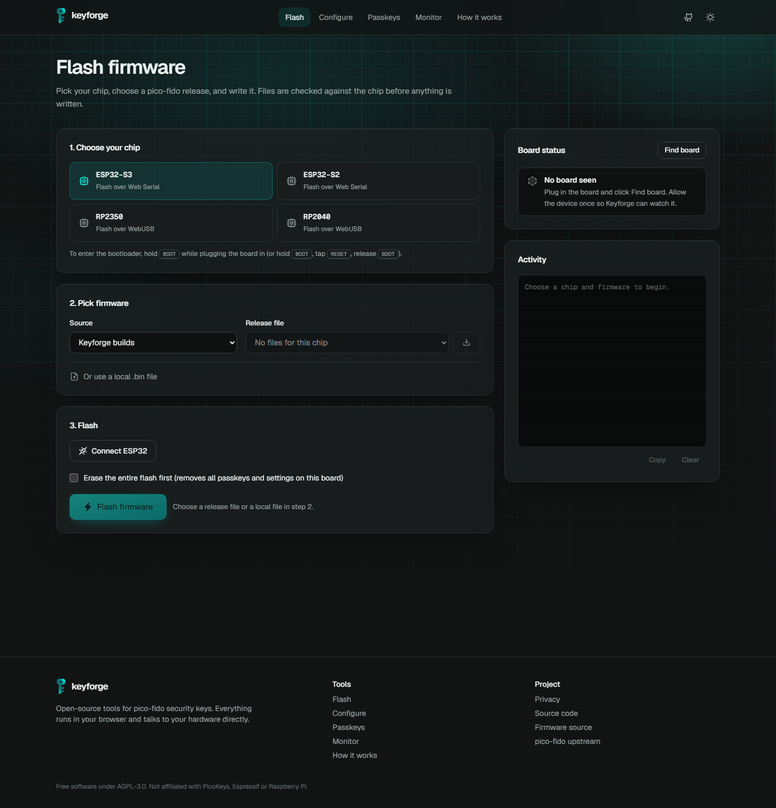
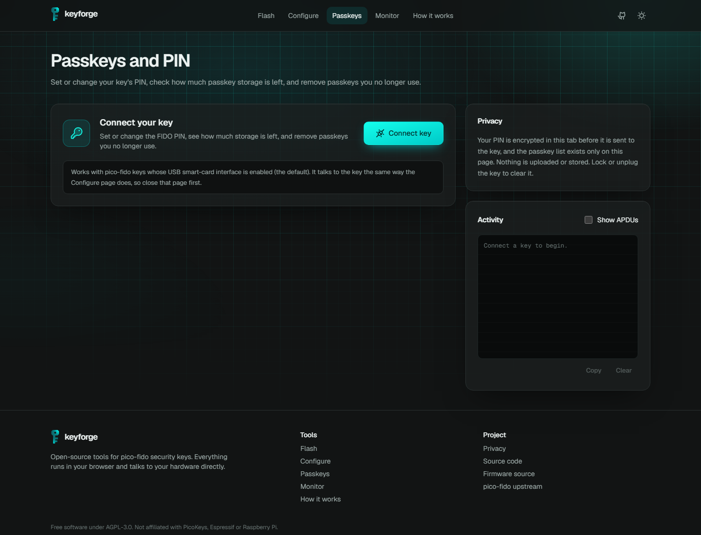
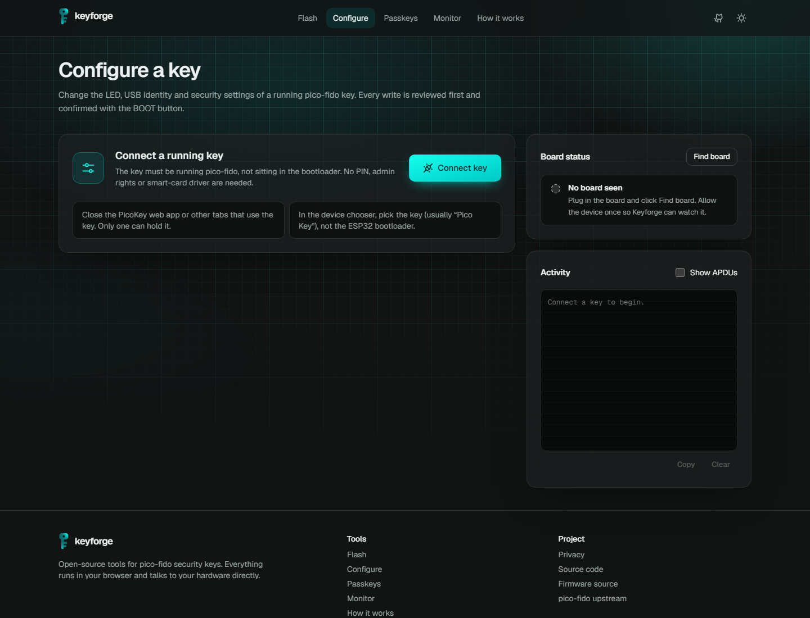
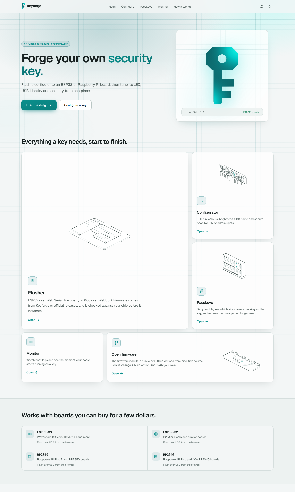
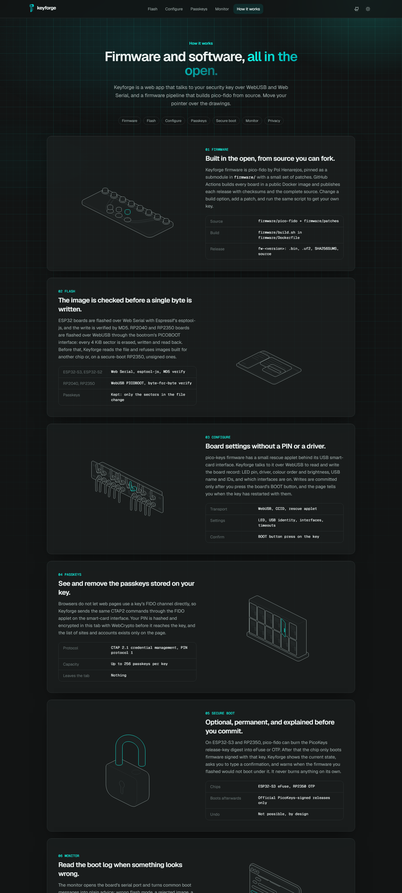

<div align="center">

<picture>
  <source media="(prefers-color-scheme: dark)" srcset="public/brand/keyforge-logo-on-dark.svg">
  
</picture>

### A $5 board. A browser tab. Your own FIDO2 security key.

Flash, configure and manage open-source [pico-fido](https://github.com/polhenarejos/pico-fido) keys on ESP32 and Raspberry Pi
boards, with firmware built in the open by GitHub Actions.

[**keyforge.tech**](https://keyforge.tech) · [How it works](https://keyforge.tech/how-it-works) · [Build your own firmware](firmware/README.md)

[](https://github.com/SamieTheCoder/keyforge/actions/workflows/ci.yml)
[](https://github.com/SamieTheCoder/keyforge/actions/workflows/firmware.yml)
[](LICENSE)



</div>

---

## Why

Hardware security keys cost $25 to $70. pico-fido turns a $3 to $8 microcontroller into a FIDO2 / WebAuthn key with passkeys, PIN,
OATH and OTP. Getting it onto a board used to mean toolchains, `esptool`, `picotool` and a desktop app.

Keyforge does all of it in the browser. No install, no drivers, no account.

## What it does

| | |
| --- | --- |
| ⚡ **Flash** | ESP32-S3 / S2 over Web Serial (esptool-js, MD5 verified). RP2040 / RP2350 over WebUSB PICOBOOT, every sector read back. Wrong-chip and unsigned-for-secure-boot images are refused before a byte is written. |
| 🎛️ **Configure** | LED pin, driver, colour palette and brightness, USB name and IDs, interfaces, button timeout. Each write is reviewed, then confirmed with the BOOT button, and the page tells you when it is applied. |
| 🔑 **Passkeys** | Set or change the PIN, see storage used, list every site and account with a passkey on the key, delete the ones you no longer use. |
| 🛡️ **Secure boot** | Read the eFuse / OTP state and, if you choose, enable or lock it with typed confirmation and plain-language warnings. |
| 🖥️ **Monitor** | Serial boot log with hints for the usual failures and per-board reset steps. |
| 🧬 **Open firmware** | pico-fido + Keyforge patches in [`firmware/`](firmware), built by CI, released with checksums and full source. Fork it and build your own. |

<table>
  <tr>
    <td></td>
    <td></td>
  </tr>
  <tr>
    <td align="center">Flasher</td>
    <td align="center">Passkeys</td>
  </tr>
  <tr>
    <td></td>
    <td></td>
  </tr>
  <tr>
    <td align="center">Configure</td>
    <td align="center">Light theme</td>
  </tr>
</table>

## Supported boards

| Chip | Example boards | Flash | Configure, Passkeys | Secure boot |
| --- | --- | --- | --- | --- |
| ESP32-S3 | Waveshare ESP32-S3-Zero, DevKitC-1 | Web Serial | ✅ | ✅ eFuse |
| ESP32-S2 | Lolin S2 Mini, Saola | Web Serial | ✅ | ✅ eFuse |
| RP2350 | Raspberry Pi Pico 2 | WebUSB | ✅ | ✅ OTP |
| RP2040 | Raspberry Pi Pico, RP2040-Zero, QT Py | WebUSB | ✅ | ✗ |

Chrome, Edge or another Chromium browser on desktop. Firefox and Safari do not support WebUSB or Web Serial.

## How it works

```
 ┌──────────────── browser tab (keyforge.tech) ───────────────┐
 │  Flasher        Configurator      Passkeys        Monitor  │
 │  esptool-js     rescue applet     CTAP2 over      line     │
 │  PICOBOOT       PHY record        CCID applet     parser   │
 └──────┬──────────────┬────────────────┬──────────────┬──────┘
   Web Serial / WebUSB │ WebUSB (CCID)  │ WebUSB (CCID)│ Web Serial
        ▼              ▼                ▼              ▼
 ┌──────────────────────── your board ────────────────────────┐
 │  ROM bootloader │ pico-fido firmware: rescue · FIDO · OATH │
 └────────────────────────────────────────────────────────────┘

 GitHub Actions ── firmware/ (pico-fido + patches) ──▶ release fw-x.y ──▶ /api/firmware ──▶ Flasher
```

- **Everything hardware-related happens in the tab.** The PIN is hashed and encrypted with WebCrypto before it reaches the key.
  Passkey lists, serial numbers and settings never leave the page.
- **The only server code** is [`/api/firmware`](src/app/api/firmware/route.ts): GitHub's release CDN has no CORS, so firmware is
  fetched same-origin. It accepts only allowlisted repositories, `.bin` / `.uf2`, at most 16 MiB.
- **Strict headers:** enforced CSP (`connect-src 'self' https://api.github.com`), `Permissions-Policy: usb=(self), serial=(self)`,
  HSTS. No analytics, no cookies.

The [How it works](https://keyforge.tech/how-it-works) page walks through each part with interactive drawings.



## Firmware, in the open

```
firmware/
├── pico-fido/   upstream source, pinned submodule (v8.0)
├── patches/     Keyforge changes, applied at build time
├── build.sh     one script for every board
└── Dockerfile   ESP-IDF 5.5.1 + Arm GCC + pico-sdk 2.1.1
```

```sh
git clone --recursive https://github.com/SamieTheCoder/keyforge && cd keyforge
docker build -t keyforge-fw firmware
docker run --rm -v "$PWD:/src" -w /src -e MAX_RESIDENT_CREDENTIALS=64 \
  keyforge-fw firmware/build.sh pico2 esp32s3
```

Every push to `firmware/` builds all boards in CI. Running the **Firmware** workflow with *publish* creates a `fw-<version>`
release with `.bin` / `.uf2` files, `SHA256SUMS` and the complete source tarball, which the Flasher lists as **Keyforge builds**.
Options, custom patches and upstream updates are in [`firmware/README.md`](firmware/README.md).

> Keyforge builds are not signed with the PicoKeys release key. Do not enable secure boot on a key running them; use the official
> release for that.

## Run it locally

```sh
npm ci
npm run dev        # http://localhost:3000 (WebUSB works on localhost)
npm test           # vitest: protocol, CBOR/CTAP, UF2, PICOBOOT, board detection
npm run typecheck && npm run lint && npm run build
```

Node 20.9+. Next.js 16, React 19, TypeScript 6, Tailwind 4. `output: 'standalone'`, so it deploys to any Node host (Vercel,
a container, a VPS). WebUSB needs HTTPS outside localhost.

### Project map

| Path | What |
| --- | --- |
| `src/lib/protocol.ts` | Rescue applet APDUs, PHY TLV, LED palettes, GPIO risk review |
| `src/lib/webusb.ts` | CCID transport over WebUSB |
| `src/lib/ctap.ts`, `cbor.ts` | CTAP2 client: PIN protocol 1, credential management |
| `src/lib/picoboot.ts` | RP2040 / RP2350 PICOBOOT, OTP secure-boot readout |
| `src/lib/firmware.ts` | ESP image and UF2 inspection, UF2 to flash sectors, release matching |
| `src/lib/boards.ts` | USB / serial board detection and boot-log hints |
| `src/components/` | Flasher, configurator, passkeys, monitor UI |
| `firmware/` | Firmware source, patches, build and release pipeline |

## Security

Found something? Please email the address in [`src/lib/site.ts`](src/lib/site.ts) rather than opening a public issue. Firmware
vulnerabilities belong upstream at [pico-fido](https://github.com/polhenarejos/pico-fido/security).

## Credits and license

- [pico-fido](https://github.com/polhenarejos/pico-fido) and pico-keys-sdk by Pol Henarejos (AGPL-3.0): the firmware.
- [picoflash](https://github.com/piersfinlayson/picoflash) by Piers Finlayson (MIT): PICOBOOT approach.
- [esptool-js](https://github.com/espressif/esptool-js) by Espressif (Apache-2.0).
- [hairline](https://github.com/lucasmarkes/hairline) by Lucas Marques (MIT): the line drawings.
- [Phosphor Icons](https://phosphoricons.com) (MIT), [Geist](https://vercel.com/font) (OFL).

Keyforge is free software under the [GNU AGPL-3.0](LICENSE). Details in [THIRD_PARTY_NOTICES.md](THIRD_PARTY_NOTICES.md).

Keyforge is an independent project. Not affiliated with or endorsed by PicoKeys, Espressif, Raspberry Pi or the FIDO Alliance.
